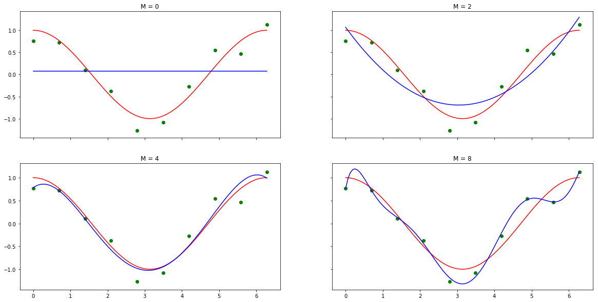
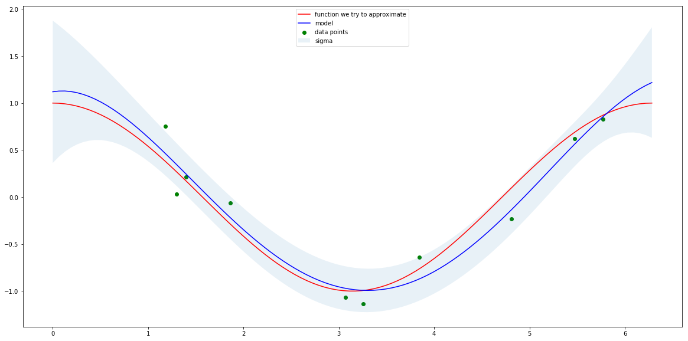
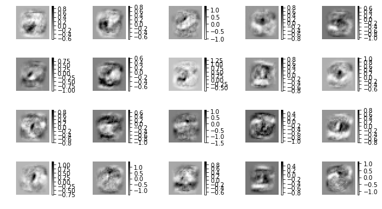
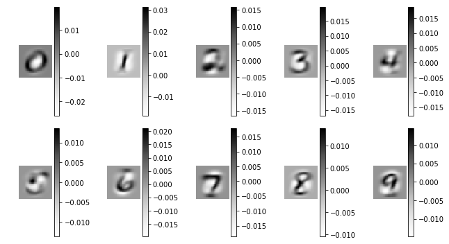
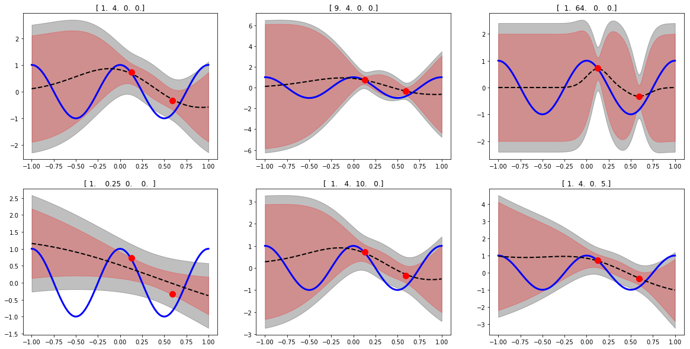
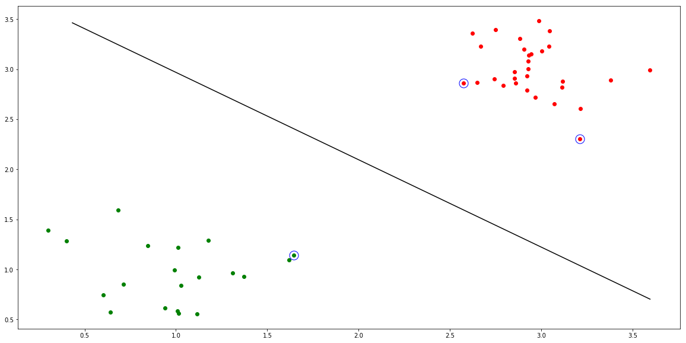

# Machine Learning 1

[](LICENSE)


## Description

Homeworks and code for the labs of the [Machine Learning 1 (2017/2018)](http://studiegids.uva.nl/xmlpages/page/2017-2018-en/search-course/course/31203) courses of the MSc in Artificial Intelligence at the University of Amsterdam.


Contributors: 
The labs where done in collaboration with [Jana Leible](https://github.com/janaleible). 

## Homeworks
- Basic Linear Algebra, Matrix Calculus and Probability Theory
- Maximum a posteriori Solution for Linear Regression, Probability Distributions, Likelihoods, and Estimators
- Naive Bayes Classification and Multi-class Logistic Regression
- Constrained Optimization, Kernel Methods and Neural Networks
- Mixture Models and PCA


## Labs
#### Polynomial Regression and Bayesian Regression

Polynomial Regression             |  Bayesian Regression
:-------------------------:|:-------------------------:
|

#### Multi-Class Logistic Regression and Multilayer Perceptrons


Learned Weights for single-layer MLP |  Learned Weights for Logistic Regression
:-------------------------:|:-------------------------:
|


#### Gaussian Processes and Support Vector Machines


<p align="center">
<i>Gaussian Process Regression</i>
</p>


<p align="center">
  <i>SVM Classification</i>
</p>

## Dependencies
With anacodna use ```environment.yml``` provided in the lab directory which contains:

- jupyter=1.0.0    
- matplotlib=2.0.2    
- numpy=1.13.1      
- python=3.6.2   
- scikit-learn=0.19.0   
- scipy=0.19.1  

### Run the labs
Make sure all the dependencies are present and execute as:
``` 
jupyter notebook NOTEBOOK_NAME.ipynb
```

### Note


Please follow the <a href="http://student.uva.nl/en/content/az/plagiarism-and-fraud/plagiarism-and-fraud.html">UvA regulations governing Fraud and Plagiarism</a> in case you are a student.